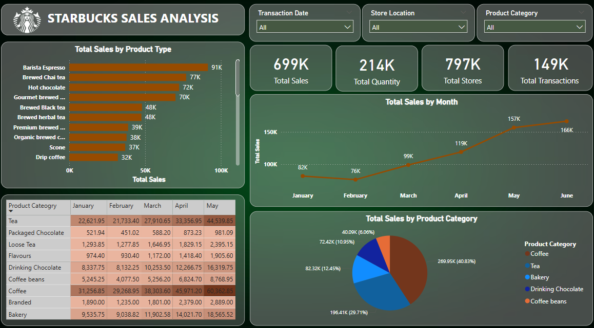

# ☕ Starbucks Sales Analysis Dashboard (Power BI)

## 📊 Project Overview

An interactive and data-driven Power BI dashboard designed to analyze and visualize Starbucks sales performance across various products, time periods, and categories. This project showcases how business intelligence tools like Power BI can transform raw sales data into actionable insights for strategic decision-making.

---

## 🎯 Objectives

- Analyze monthly sales trends and patterns.
- Identify top-performing product types and categories.
- Track store-level performance and transaction counts.
- Enable dynamic filtering for granular insights.

---

## 📈 Key KPIs

- **Total Sales:** 699K  
- **Total Quantity Sold:** 214K  
- **Total Stores:** 797K  
- **Total Transactions:** 149K

---

## 📌 Visual Highlights

### ✅ Total Sales by Product Type
- Highest: **Barista Espresso (91K)**
- Others: Brewed Chai Tea (77K), Hot Chocolate (72K), Gourmet Brewed Coffee (70K)

### 📆 Monthly Sales Trend
- Consistent growth from **January (82K)** to **June (166K)**
- Sales peak in **May and June**

### 🥧 Sales by Product Category (Pie Chart)
- **Coffee:** 40.83% (Highest)
- **Tea:** 29.71%
- **Bakery:** 12.52%
- **Drinking Chocolate, Coffee Beans:** Remaining share

### 🧾 Product Category Sales by Month
- Detailed tabular view showing monthly sales for categories like Tea, Packaged Chocolate, Loose Tea, Flavours, etc.

---

## 🖼️ Dashboard Preview

---

## 🛠 Tools & Technologies Used

- **Power BI Desktop**
- **DAX (Data Analysis Expressions)**
- **Power Query**
- **Data Modeling & Relationships**
- **Interactive Visuals and Slicers**

---

## 📁 Files Included

- `Starbucks Data Analysis.pbix` – Complete Power BI report file
- `starbucks_dashboard.png` – Dashboard image for preview

---

## 🔍 Key Insights

- Coffee-based products dominate overall sales.
- Barista Espresso is the best-selling individual item.
- Sales increase significantly during Q2 (April–June), possibly due to seasonal trends.
- Tea and Bakery categories show strong potential for growth.

---

## 🚀 Future Improvements

- Add **profitability** and **cost analysis** metrics.
- Include **store-wise performance heatmap** using location data.
- Connect with **real-time data sources** for live reporting.
- Integrate **customer segmentation** and loyalty program metrics.

---

## 📧 Contact

Feel free to reach out for feedback or collaborations!  
**Author**: Sarthak Salvi  
**Email**: [sarthaksalvi2107@gmail.com]

---

## 📌 License

This project is for educational and portfolio purposes only.

---

⭐ *If you like this project, don't forget to give it a star!*
